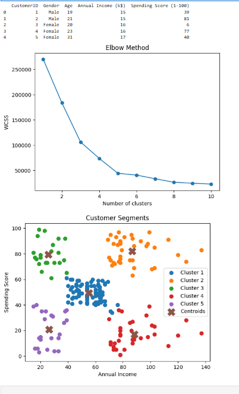

# PRODIGY_ML_02

## 📌 Task: Customer Segmentation using K-Means Clustering

### 🎯 Objective
To group customers of a retail store based on their purchase behavior using K-Means clustering.

---

### 📊 Dataset

The dataset used in this project is the Mall Customers dataset.

🔗 Dataset Link:  
https://www.kaggle.com/datasets/vjchoudhary7/customer-segmentation-tutorial-in-python

---

### ⚙️ Technologies Used
- Python
- Pandas
- NumPy
- Matplotlib
- Scikit-learn

---

### 🚀 Steps Performed
1. Data Loading
2. Data Preprocessing
3. Feature Selection
4. Applying K-Means Algorithm
5. Elbow Method for optimal clusters
6. Data Visualization

---

### 📈 Output
Customers are grouped into different clusters based on income and spending score.

---

### 📷 Output Screenshot

---
